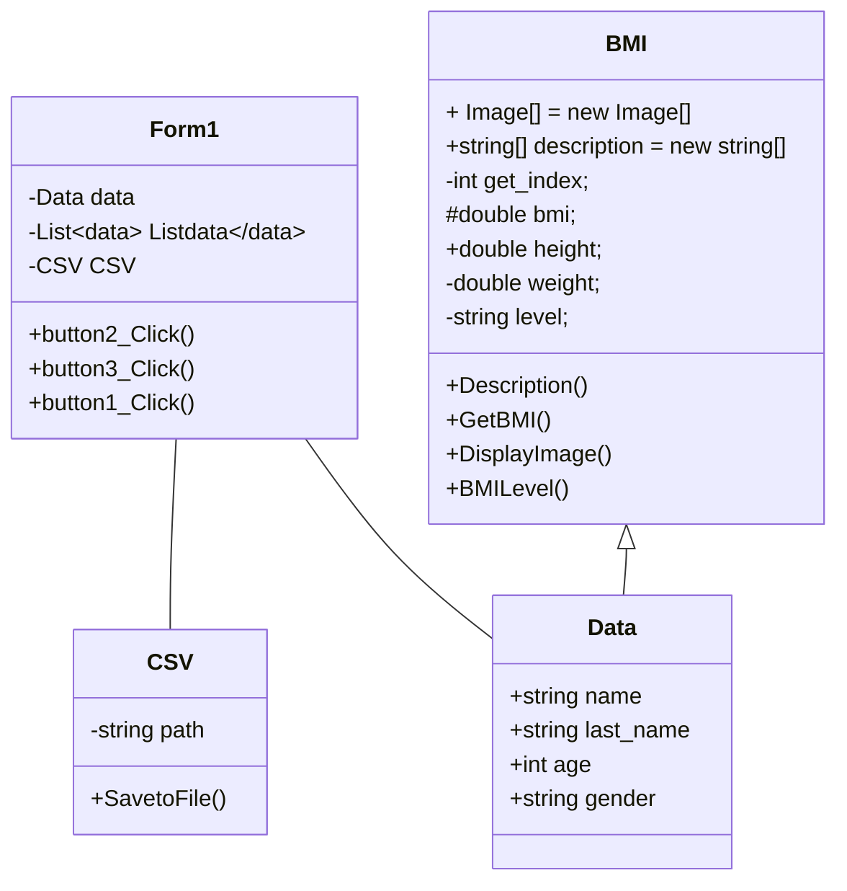

### ความเป็นมา
ปัจจุบันมีคนเสี่ยงเป็นโรคขาดสารอาหารและโรคโรคอ้วนมากขึ้นผมจึงได้ทำโปรแกรมนี้มาเพื่อทำให้เราทราบค่าว่าเรามีค่าBMIเท่าไรเพื่อช่วยให้เข้าใจเกี่ยวกับสุขภาพของตนเองและต้องการการปรับปรุงในด้านการออกกำลังกายและการบริโภคอาหารเพื่อสุขภาพที่ดีขึ้น
### วัตถุประสงค์ของโปรแกรม
ทำให้เราทราบค่าดัชนีมวลกาย(ฺBMI)ว่าเราอยู่ระดับไหนและสามารถรู้ได้ว่าสุขภาพเราเป็นอย่างไรทำให้เราสารถแก้ไขปัญหาการเกิดโรคต่างๆได้
### โครงสร้างโปรแกรม

### ผู้พัฒนาโปรแกรม
นายปภพ สุระทิพย์ 663450176-7